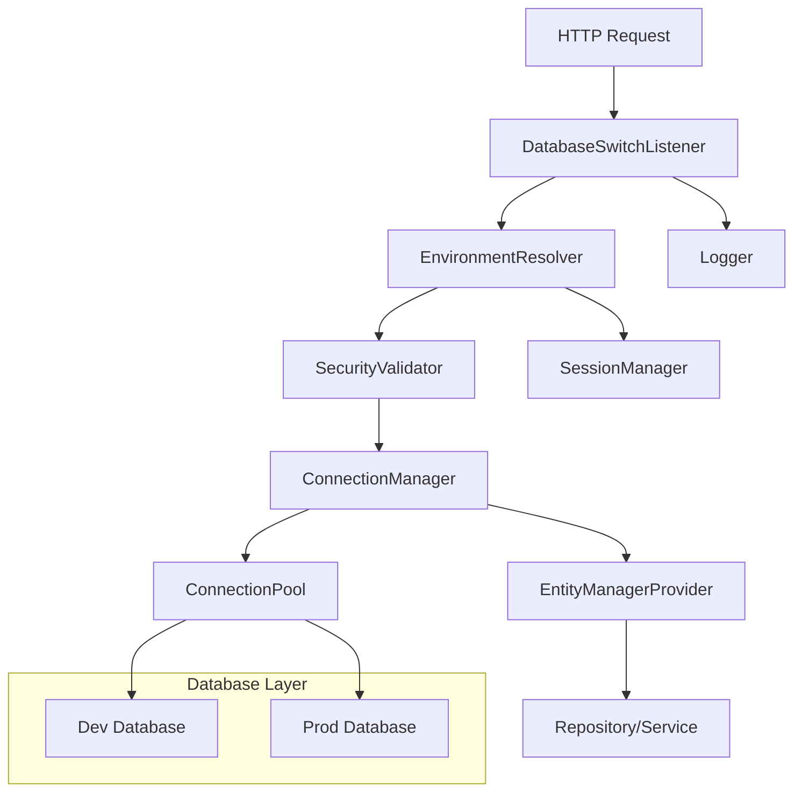

# Design Document - Database Environment Switcher

## Overview

Le système de basculement automatique de base de données permet aux développeurs de switcher dynamiquement entre les environnements de développement et de production via des paramètres URL ou des headers HTTP. Cette fonctionnalité améliore significativement l'expérience de développement en permettant de tester avec différents jeux de données sans redéploiement.

Le système actuel présente plusieurs problèmes architecturaux qui nécessitent une refonte complète :
- Configuration incohérente des services
- Gestion défaillante des EntityManagers
- Absence de sécurité et de logging
- Manque de robustesse face aux erreurs

## Architecture

### Vue d'ensemble du système



### Flux de traitement

1. **Interception de requête** : Le `DatabaseSwitchListener` intercepte toutes les requêtes HTTP
2. **Résolution d'environnement** : L'`EnvironmentResolver` détermine l'environnement cible
3. **Validation sécuritaire** : Le `SecurityValidator` vérifie les permissions d'accès
4. **Gestion de connexion** : Le `ConnectionManager` établit la connexion appropriée
5. **Injection d'EntityManager** : L'`EntityManagerProvider` fournit le bon EntityManager
6. **Persistance de session** : Le `SessionManager` maintient l'état entre les requêtes

## Components and Interfaces

### 1. DatabaseSwitchListener

**Responsabilité** : Point d'entrée principal pour intercepter les requêtes et orchestrer le basculement.

```php
interface DatabaseSwitchListenerInterface
{
    public function onKernelRequest(RequestEvent $event): void;
    public function determineEnvironment(Request $request): string;
    public function validateSecurity(string $environment, Request $request): bool;
}
```

### 2. EnvironmentResolver

**Responsabilité** : Logique de résolution de l'environnement basée sur les paramètres de requête.

```php
interface EnvironmentResolverInterface
{
    public function resolve(Request $request): EnvironmentContext;
    public function getFromUrlParameter(Request $request): ?string;
    public function getFromHeader(Request $request): ?string;
    public function getFromSession(Request $request): ?string;
    public function getDefault(): string;
}
```

### 3. ConnectionManager

**Responsabilité** : Gestion des connexions de base de données et des pools de connexions.

```php
interface ConnectionManagerInterface
{
    public function getConnection(string $environment): Connection;
    public function validateConnection(string $environment): bool;
    public function switchConnection(string $environment): void;
    public function getConnectionStatus(string $environment): ConnectionStatus;
}
```

### 4. EntityManagerProvider

**Responsabilité** : Fournit les EntityManagers appropriés selon l'environnement actuel.

```php
interface EntityManagerProviderInterface
{
    public function getEntityManager(?string $environment = null): EntityManagerInterface;
    public function getCurrentEnvironment(): string;
    public function resetEntityManager(string $environment): void;
}
```

### 5. SecurityValidator

**Responsabilité** : Validation des permissions d'accès aux différents environnements.

```php
interface SecurityValidatorInterface
{
    public function canAccessEnvironment(string $environment, Request $request): bool;
    public function validateIpAccess(Request $request): bool;
    public function checkRateLimit(Request $request): bool;
    public function logSecurityViolation(Request $request, string $reason): void;
}
```

### 6. SessionManager

**Responsabilité** : Gestion de la persistance de l'environnement en session.

```php
interface SessionManagerInterface
{
    public function storeEnvironment(string $environment, Request $request): void;
    public function getStoredEnvironment(Request $request): ?string;
    public function clearEnvironment(Request $request): void;
    public function isSessionAvailable(Request $request): bool;
}
```

## Data Models

### EnvironmentContext

```php
class EnvironmentContext
{
    private string $environment;
    private string $source; // 'url', 'header', 'session', 'default'
    private array $metadata;
    private \DateTimeImmutable $resolvedAt;
    
    public function __construct(
        string $environment,
        string $source,
        array $metadata = [],
        ?\DateTimeImmutable $resolvedAt = null
    ) {
        $this->environment = $environment;
        $this->source = $source;
        $this->metadata = $metadata;
        $this->resolvedAt = $resolvedAt ?? new \DateTimeImmutable();
    }
    
    // Getters...
}
```

### ConnectionStatus

```php
class ConnectionStatus
{
    private string $environment;
    private bool $isConnected;
    private bool $isHealthy;
    private array $connectionParams;
    private ?\Exception $lastError;
    private \DateTimeImmutable $lastChecked;
    
    // Constructor and methods...
}
```

### SecurityContext

```php
class SecurityContext
{
    private string $clientIp;
    private array $allowedIps;
    private bool $isProduction;
    private array $userRoles;
    private int $requestCount;
    private \DateTimeImmutable $windowStart;
    
    // Constructor and methods...
}
```

## Correctness Properties

*A property is a characteristic or behavior that should hold true across all valid executions of a system-essentially, a formal statement about what the system should do. Properties serve as the bridge between human-readable specifications and machine-verifiable correctness guarantees.*

### Property Reflection

After reviewing all properties identified in the prework, several can be consolidated:
- Properties 1.1 and 1.2 can be combined into a single "Environment routing" property
- Properties 3.1 and 3.2 can be combined into a single "Header-based routing" property  
- Properties 5.1, 5.2, 5.3 can be combined into a comprehensive "Logging behavior" property
- Properties 6.1, 6.2, 6.3 can be combined into a "Security validation" property

### Core Properties

**Property 1: Environment parameter routing**
*For any* API request with a valid environment parameter (`dev` or `prod`), all database operations should route to the corresponding database environment
**Validates: Requirements 1.1, 1.2**

**Property 2: Default environment fallback**
*For any* API request without environment parameter or with invalid parameter, all database operations should route to the production database
**Validates: Requirements 1.3, 1.4**

**Property 3: Connection validation before switching**
*For any* environment switch request, the target database connection should be validated as available before the switch occurs
**Validates: Requirements 1.5**

**Property 4: Session persistence consistency**
*For any* valid environment parameter provided, the environment choice should be stored in session and used for subsequent requests without parameters
**Validates: Requirements 2.1, 2.2, 2.3**

**Property 5: Session fallback resilience**
*For any* session failure or expiration, the system should gracefully fallback to production environment without throwing errors
**Validates: Requirements 2.4, 2.5**

**Property 6: Header-based environment routing**
*For any* request with `X-Database-Env` header containing valid environment value, database operations should route to the specified environment
**Validates: Requirements 3.1, 3.2**

**Property 7: Parameter precedence consistency**
*For any* request containing both URL parameter and header, the URL parameter should take precedence over the header value
**Validates: Requirements 3.3**

**Property 8: Invalid header handling**
*For any* request with invalid environment header values, the header should be ignored and default behavior should apply
**Validates: Requirements 3.4, 3.5**

**Property 9: Automatic EntityManager injection**
*For any* repository or service method call, the correct EntityManager for the current environment should be automatically provided
**Validates: Requirements 4.1, 4.3**

**Property 10: Request-level environment consistency**
*For any* single request, all database operations should use the same environment throughout the request lifecycle
**Validates: Requirements 4.2, 4.5**

**Property 11: Transaction environment integrity**
*For any* database transaction, all operations within the transaction should use the same environment connection
**Validates: Requirements 4.4**

**Property 12: Comprehensive logging behavior**
*For any* environment determination, connection failure, or invalid parameter, appropriate log entries should be created with relevant details
**Validates: Requirements 5.1, 5.2, 5.3**

**Property 13: Response header indication**
*For any* API response, headers should indicate which database environment was used for the request
**Validates: Requirements 5.4**

**Property 14: Debug mode information**
*For any* request when debug mode is enabled, detailed connection information should be included in API responses
**Validates: Requirements 5.5**

**Property 15: Security access control**
*For any* request attempting to access development database in production mode, IP-based access control and permission validation should be enforced
**Validates: Requirements 6.1, 6.2, 6.3**

**Property 16: Security violation handling**
*For any* security violation, the system should implement rate limiting and comprehensive audit logging
**Validates: Requirements 6.4, 6.5**

**Property 17: Database unavailability fallback**
*For any* target database that becomes unavailable, the system should attempt fallback to the default database
**Validates: Requirements 7.1**

**Property 18: Complete failure error handling**
*For any* scenario where all database connections fail, appropriate HTTP error responses with diagnostic information should be returned
**Validates: Requirements 7.2**

**Property 19: Connection retry with backoff**
*For any* connection timeout, the system should retry the connection using exponential backoff strategy
**Validates: Requirements 7.3**

**Property 20: Schema mismatch resilience**
*For any* detected database schema mismatch, warnings should be logged and available operations should continue
**Validates: Requirements 7.4, 7.5**

## Error Handling

### Error Categories

1. **Configuration Errors**
   - Invalid database URLs
   - Missing environment configurations
   - Malformed connection parameters

2. **Runtime Errors**
   - Database connection failures
   - Network timeouts
   - Authentication failures

3. **Security Errors**
   - Unauthorized access attempts
   - Rate limit violations
   - IP restriction violations

4. **Data Errors**
   - Schema mismatches
   - Migration inconsistencies
   - Data corruption detection

### Error Recovery Strategies

1. **Graceful Degradation** : Fallback to production database when development database is unavailable
2. **Circuit Breaker Pattern** : Temporarily disable problematic connections
3. **Retry with Backoff** : Exponential backoff for transient failures
4. **Health Checks** : Periodic validation of database connections
5. **Audit Logging** : Comprehensive logging of all error conditions

## Testing Strategy

### Dual Testing Approach

The system requires both unit testing and property-based testing for comprehensive coverage:

**Unit Tests** verify:
- Specific configuration scenarios
- Error handling edge cases  
- Integration between components
- Security validation logic

**Property-Based Tests** verify:
- Universal routing behavior across all environments
- Session persistence across random request patterns
- Security enforcement across various attack vectors
- Error recovery across different failure modes

### Property-Based Testing Framework

We will use **Infection** for PHP property-based testing, configured to run a minimum of 100 iterations per property test.

Each property-based test must be tagged with the format:
`**Feature: database-environment-switcher, Property {number}: {property_text}**`

### Test Categories

1. **Environment Resolution Tests**
   - URL parameter parsing
   - Header processing
   - Session retrieval
   - Default fallback

2. **Connection Management Tests**
   - Database switching
   - Connection pooling
   - Health monitoring
   - Failover scenarios

3. **Security Tests**
   - Access control validation
   - Rate limiting
   - Audit logging
   - IP restrictions

4. **Integration Tests**
   - End-to-end request processing
   - Repository injection
   - Transaction handling
   - Error propagation

5. **Performance Tests**
   - Connection switching overhead
   - Session storage performance
   - Logging impact
   - Memory usage patterns