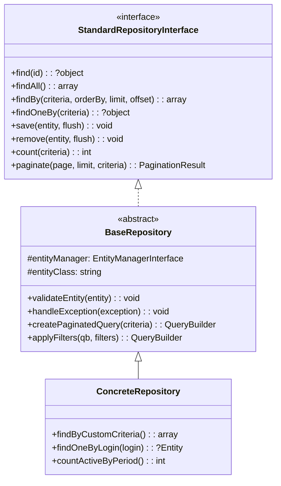
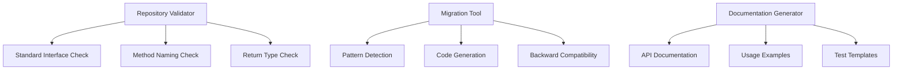

# Design Document: Repository Standardization

## Overview

This design establishes a standardized architecture for repository classes in the Symfony application. The current codebase contains numerous repositories with inconsistent patterns, duplicated code, and varying approaches to data access. This standardization will create a unified interface, base implementation, and validation system to ensure consistent, maintainable repository code.

The design leverages Symfony's existing ServiceEntityRepository pattern while adding standardized interfaces, base classes, and automated validation tools.

## Architecture

### Component Hierarchy



### Service Integration



## Components and Interfaces

### StandardRepositoryInterface

The core interface that all repositories must implement:

```php
<?php

namespace App\Repository\Interface;

use App\Repository\Result\PaginationResult;

interface StandardRepositoryInterface
{
    // Core CRUD operations
    public function find(mixed $id): ?object;
    public function findAll(): array;
    public function findBy(array $criteria, ?array $orderBy = null, ?int $limit = null, ?int $offset = null): array;
    public function findOneBy(array $criteria): ?object;
    public function save(object $entity, bool $flush = true): void;
    public function remove(object $entity, bool $flush = true): void;
    
    // Counting and pagination
    public function count(array $criteria = []): int;
    public function paginate(int $page = 1, int $limit = 20, array $criteria = []): PaginationResult;
    
    // Validation and error handling
    public function validateEntity(object $entity): void;
    public function getEntityClass(): string;
}
```

### BaseRepository

Abstract base class providing common functionality:

```php
<?php

namespace App\Repository\Base;

use App\Repository\Interface\StandardRepositoryInterface;
use App\Repository\Result\PaginationResult;
use Doctrine\Bundle\DoctrineBundle\Repository\ServiceEntityRepository;
use Doctrine\ORM\QueryBuilder;
use Doctrine\Persistence\ManagerRegistry;

abstract class BaseRepository extends ServiceEntityRepository implements StandardRepositoryInterface
{
    public function __construct(ManagerRegistry $registry, string $entityClass)
    {
        parent::__construct($registry, $entityClass);
    }
    
    // Standardized CRUD implementations
    public function save(object $entity, bool $flush = true): void
    {
        $this->validateEntity($entity);
        $this->getEntityManager()->persist($entity);
        
        if ($flush) {
            $this->getEntityManager()->flush();
        }
    }
    
    public function remove(object $entity, bool $flush = true): void
    {
        $this->getEntityManager()->remove($entity);
        
        if ($flush) {
            $this->getEntityManager()->flush();
        }
    }
    
    // Pagination support
    public function paginate(int $page = 1, int $limit = 20, array $criteria = []): PaginationResult
    {
        $qb = $this->createPaginatedQuery($criteria);
        $qb->setFirstResult(($page - 1) * $limit)
           ->setMaxResults($limit);
           
        return new PaginationResult(
            $qb->getQuery()->getResult(),
            $this->count($criteria),
            $page,
            $limit
        );
    }
    
    // Protected helper methods
    protected function createPaginatedQuery(array $criteria): QueryBuilder
    {
        $qb = $this->createQueryBuilder('e');
        return $this->applyFilters($qb, $criteria);
    }
    
    protected function applyFilters(QueryBuilder $qb, array $filters): QueryBuilder
    {
        foreach ($filters as $field => $value) {
            if ($value !== null) {
                $qb->andWhere("e.{$field} = :{$field}")
                   ->setParameter($field, $value);
            }
        }
        return $qb;
    }
    
    // Validation and error handling
    public function validateEntity(object $entity): void
    {
        if (!$entity instanceof $this->getEntityClass()) {
            throw new \InvalidArgumentException(
                sprintf('Expected entity of type %s, got %s', $this->getEntityClass(), get_class($entity))
            );
        }
    }
    
    public function getEntityClass(): string
    {
        return $this->getClassName();
    }
}
```

### PaginationResult

Data transfer object for paginated results:

```php
<?php

namespace App\Repository\Result;

class PaginationResult
{
    public function __construct(
        private array $items,
        private int $totalCount,
        private int $currentPage,
        private int $itemsPerPage
    ) {}
    
    public function getItems(): array
    {
        return $this->items;
    }
    
    public function getTotalCount(): int
    {
        return $this->totalCount;
    }
    
    public function getCurrentPage(): int
    {
        return $this->currentPage;
    }
    
    public function getItemsPerPage(): int
    {
        return $this->itemsPerPage;
    }
    
    public function getTotalPages(): int
    {
        return (int) ceil($this->totalCount / $this->itemsPerPage);
    }
    
    public function hasNextPage(): bool
    {
        return $this->currentPage < $this->getTotalPages();
    }
    
    public function hasPreviousPage(): bool
    {
        return $this->currentPage > 1;
    }
}
```

## Data Models

### Repository Validation Rules

```php
<?php

namespace App\Repository\Validation;

class RepositoryValidationRule
{
    private string $ruleName;
    private string $description;
    private callable $validator;
    private string $errorMessage;
    
    public function __construct(string $ruleName, string $description, callable $validator, string $errorMessage)
    {
        $this->ruleName = $ruleName;
        $this->description = $description;
        $this->validator = $validator;
        $this->errorMessage = $errorMessage;
    }
    
    public function validate(\ReflectionClass $repositoryClass): ValidationResult
    {
        try {
            $isValid = ($this->validator)($repositoryClass);
            return new ValidationResult($this->ruleName, $isValid, $isValid ? null : $this->errorMessage);
        } catch (\Exception $e) {
            return new ValidationResult($this->ruleName, false, $e->getMessage());
        }
    }
}
```

### Migration Report

```php
<?php

namespace App\Repository\Migration;

class MigrationReport
{
    private array $migratedRepositories = [];
    private array $errors = [];
    private array $warnings = [];
    
    public function addMigratedRepository(string $className, array $changes): void
    {
        $this->migratedRepositories[$className] = $changes;
    }
    
    public function addError(string $className, string $error): void
    {
        $this->errors[$className][] = $error;
    }
    
    public function addWarning(string $className, string $warning): void
    {
        $this->warnings[$className][] = $warning;
    }
    
    public function generateSummary(): array
    {
        return [
            'total_repositories' => count($this->migratedRepositories),
            'successful_migrations' => count(array_filter($this->migratedRepositories, fn($changes) => !empty($changes))),
            'errors' => count($this->errors),
            'warnings' => count($this->warnings),
            'details' => [
                'migrated' => $this->migratedRepositories,
                'errors' => $this->errors,
                'warnings' => $this->warnings
            ]
        ];
    }
}
```

Now I need to use the prework tool to analyze the acceptance criteria before writing the correctness properties:

<function_calls>
<invoke name="prework">
<parameter name="featureName">repository-standardization

## Correctness Properties

*A property is a characteristic or behavior that should hold true across all valid executions of a system—essentially, a formal statement about what the system should do. Properties serve as the bridge between human-readable specifications and machine-verifiable correctness guarantees.*

After analyzing the acceptance criteria, I've identified the following properties that can be automatically tested. Some criteria focus on structural requirements (interface definitions) which are better validated through examples, while others describe universal behaviors suitable for property-based testing.

### Property Reflection

Looking at all the testable properties from the prework analysis, I can identify some areas for consolidation:

- Properties about interface structure (1.1, 1.3, 1.5, 2.1) are better handled as structural examples
- Properties about validation system behavior (4.1-4.4) can be combined into comprehensive validation properties
- Properties about migration tool behavior (5.1-5.5) can be grouped by functionality
- Properties about code generation (6.1, 6.2, 6.3, 6.4, 6.5) can be consolidated

### Core Properties

**Property 1: Repository Interface Compliance**
*For any* repository class in the system, it should implement the StandardRepositoryInterface and provide all required CRUD methods
**Validates: Requirements 1.2**

**Property 2: Method Naming Convention Consistency**
*For any* custom query method in any repository, the method name should follow established conventions (findBy*, findOneBy*, countBy*, etc.)
**Validates: Requirements 1.4, 3.1**

**Property 3: Repository Inheritance Consistency**
*For any* repository extending BaseRepository, it should inherit all standard CRUD methods and maintain their signatures
**Validates: Requirements 2.2**

**Property 4: Error Handling Consistency**
*For any* repository method that encounters an error condition, it should throw standardized exceptions with consistent error messages
**Validates: Requirements 2.3, 3.5**

**Property 5: Transaction Handling Consistency**
*For any* database operation performed through BaseRepository, transaction state should be handled consistently across all operations
**Validates: Requirements 2.4**

**Property 6: Pagination Functionality**
*For any* valid pagination parameters (page, limit, criteria), the pagination method should return results with correct counts and page information
**Validates: Requirements 2.5**

**Property 7: Query Builder Usage**
*For any* complex query method in a repository, it should use QueryBuilder instead of raw SQL for database operations
**Validates: Requirements 3.2**

**Property 8: Input Validation Consistency**
*For any* query method receiving parameters, it should validate and sanitize inputs before using them in database queries
**Validates: Requirements 3.3**

**Property 9: Return Type Consistency**
*For any* repository method, the actual return type should match the declared return type (entities, arrays, or null)
**Validates: Requirements 3.4**

**Property 10: Validation Rule Effectiveness**
*For any* repository class, the validation system should correctly identify whether it conforms to standards or not
**Validates: Requirements 4.1, 4.2, 4.3, 4.4**

**Property 11: Migration Functionality Preservation**
*For any* repository migrated by the migration tool, all existing public methods should maintain the same behavior and signatures
**Validates: Requirements 5.1, 5.3**

**Property 12: Migration Detection Accuracy**
*For any* repository in the system, the migration tool should correctly identify whether it conforms to standards
**Validates: Requirements 5.2**

**Property 13: Migration Reporting Completeness**
*For any* migration operation, the tool should generate a complete report containing all changes, errors, and warnings
**Validates: Requirements 5.4**

**Property 14: Post-Migration Validation**
*For any* completed migration, all migrated repositories should pass the validation system
**Validates: Requirements 5.5**

**Property 15: Documentation Generation Completeness**
*For any* repository with public methods, the documentation generator should create complete API documentation for all methods
**Validates: Requirements 6.1, 6.3**

**Property 16: Code Generation Consistency**
*For any* new entity, the code generator should create a repository template that follows all established standards
**Validates: Requirements 6.2, 6.5**

**Property 17: Documentation Synchronization**
*For any* change to repository interfaces, the documentation generator should update the documentation to reflect the changes
**Validates: Requirements 6.4**

## Error Handling

### Exception Hierarchy

```php
<?php

namespace App\Repository\Exception;

// Base repository exception
class RepositoryException extends \Exception {}

// Validation exceptions
class EntityValidationException extends RepositoryException {}
class InvalidCriteriaException extends RepositoryException {}
class InvalidParameterException extends RepositoryException {}

// Query exceptions
class QueryExecutionException extends RepositoryException {}
class InvalidQueryException extends RepositoryException {}

// Migration exceptions
class MigrationException extends RepositoryException {}
class BackwardCompatibilityException extends MigrationException {}
```

### Error Handling Patterns

1. **Input Validation Errors**: Throw `InvalidParameterException` with descriptive messages
2. **Entity Validation Errors**: Throw `EntityValidationException` with field-specific details
3. **Query Execution Errors**: Wrap Doctrine exceptions in `QueryExecutionException`
4. **Migration Errors**: Provide detailed error context in `MigrationException`

### Logging Strategy

- Log all repository exceptions at ERROR level
- Log validation warnings at WARN level
- Log migration progress at INFO level
- Include context: repository class, method, parameters

## Testing Strategy

### Dual Testing Approach

The testing strategy employs both unit tests and property-based tests to ensure comprehensive coverage:

**Unit Tests**: Focus on specific examples, edge cases, and error conditions
- Interface structure validation (Requirements 1.1, 1.3, 1.5, 2.1)
- Specific error scenarios and exception handling
- Integration points between components
- Edge cases in pagination and filtering

**Property-Based Tests**: Verify universal properties across all inputs
- Repository interface compliance across all repository classes
- Method naming conventions across all custom methods
- Consistent behavior across all database operations
- Migration tool effectiveness across different repository types

### Property-Based Testing Configuration

- **Testing Library**: Use `giorgiosironi/eris` (already available in the project)
- **Test Iterations**: Minimum 100 iterations per property test
- **Test Tagging**: Each property test must reference its design document property

**Tag Format**: `Feature: repository-standardization, Property {number}: {property_text}`

### Test Organization

```
tests/
├── Unit/
│   ├── Repository/
│   │   ├── Interface/StandardRepositoryInterfaceTest.php
│   │   ├── Base/BaseRepositoryTest.php
│   │   └── Validation/ValidationRuleTest.php
│   └── Migration/MigrationToolTest.php
└── Property/
    ├── RepositoryComplianceTest.php
    ├── MethodNamingTest.php
    ├── ErrorHandlingTest.php
    └── MigrationTest.php
```

### Example Property Test Structure

```php
<?php

namespace App\Tests\Property\Repository;

use Eris\Generator;
use Eris\TestTrait;
use PHPUnit\Framework\TestCase;

class RepositoryComplianceTest extends TestCase
{
    use TestTrait;
    
    /**
     * Feature: repository-standardization, Property 1: Repository Interface Compliance
     */
    public function testRepositoryInterfaceCompliance(): void
    {
        $this->forAll(
            Generator::elements($this->getAllRepositoryClasses())
        )->then(function (string $repositoryClass) {
            $reflection = new \ReflectionClass($repositoryClass);
            $this->assertTrue(
                $reflection->implementsInterface(StandardRepositoryInterface::class),
                "Repository {$repositoryClass} must implement StandardRepositoryInterface"
            );
        });
    }
    
    private function getAllRepositoryClasses(): array
    {
        // Return all repository classes in the system
        return [
            UserRepository::class,
            BoutiqueRepository::class,
            ClientRepository::class,
            // ... other repositories
        ];
    }
}
```

### Integration with CI/CD

- Run property tests in CI pipeline with extended iteration counts (500+)
- Generate test coverage reports for both unit and property tests
- Fail builds if any repository validation rules are violated
- Generate migration reports as build artifacts