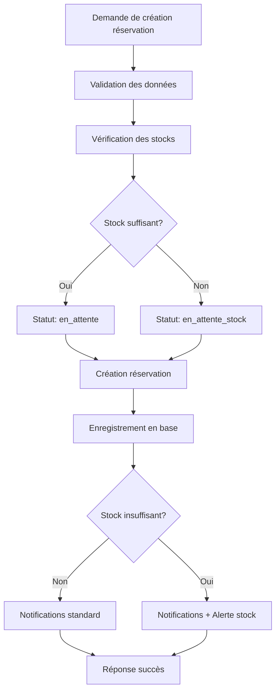

# Design Document

## Overview

Cette conception détaille les modifications nécessaires à l'API de création de réservation pour permettre la création de réservations avec stocks insuffisants tout en notifiant l'administrateur. La solution préserve entièrement la logique existante pour les cas normaux et ajoute une gestion intelligente des ruptures de stock.

## Architecture

### Composants Modifiés

1. **ApiReservationController::create()** - Logique principale de création
2. **ReservationStatus Enum** - Ajout du nouveau statut "en_attente_stock"
3. **Services de notification** - Extension pour les notifications de rupture
4. **Templates d'email** - Nouveau template pour les alertes de stock

### Flux de Traitement



## Components and Interfaces

### 1. Modification du Contrôleur

**Classe:** `ApiReservationController`
**Méthode:** `create()`

**Changements principaux:**
- Suppression du blocage sur stock insuffisant
- Ajout de la détection des ruptures de stock
- Calcul des déficits par article
- Envoi de notifications spécialisées

### 2. Extension de l'Enum ReservationStatus

```php
enum ReservationStatus: string
{
    case EN_ATTENTE = 'en_attente';
    case EN_ATTENTE_STOCK = 'en_attente_stock';  // NOUVEAU
    case CONFIRMEE = 'confirmee';
    case ANNULEE = 'annulee';
}
```

### 3. Service de Notification Étendu

**Nouvelles méthodes:**
- `sendStockAlertNotification()` - Notification push spécialisée
- `sendStockAlertEmail()` - Email détaillé avec déficits

### 4. Structure des Données de Rupture

```php
class StockDeficit
{
    public string $modeleName;
    public int $quantityRequested;
    public int $quantityAvailable;
    public int $deficit;
    public string $boutiqueId;
}
```

## Data Models

### Modifications de l'Entité Reservation

Aucune modification structurelle nécessaire. Le champ `status` existant supportera la nouvelle valeur `en_attente_stock`.

### Données de Notification

**Structure pour email de rupture de stock:**
```php
[
    'boutique_name' => string,
    'client_info' => [
        'nom' => string,
        'telephone' => string
    ],
    'reservation_info' => [
        'montant' => int,
        'avance' => int,
        'date_retrait' => string
    ],
    'stock_deficits' => [
        [
            'modele_name' => string,
            'quantity_requested' => int,
            'quantity_available' => int,
            'deficit' => int
        ]
    ],
    'created_by' => string,
    'created_at' => string
]
```

## Correctness Properties

*A property is a characteristic or behavior that should hold true across all valid executions of a system-essentially, a formal statement about what the system should do. Properties serve as the bridge between human-readable specifications and machine-verifiable correctness guarantees.*

### Property 1: Réservation toujours créée
*For any* valid reservation request, the system should create the reservation regardless of stock availability
**Validates: Requirements 1.1, 1.4**

### Property 2: Statut correct selon stock
*For any* reservation creation, if stock is insufficient then status should be "en_attente_stock", otherwise "en_attente"
**Validates: Requirements 1.2, 4.1, 4.2**

### Property 3: Calcul correct des déficits
*For any* reservation with insufficient stock, the recorded deficit should equal (quantity_requested - quantity_available) for each item
**Validates: Requirements 1.5**

### Property 4: Notifications envoyées pour stock insuffisant
*For any* reservation created with insufficient stock, both email and push notifications should be sent to the administrator
**Validates: Requirements 2.1, 2.2**

### Property 5: Contenu complet des emails d'alerte
*For any* stock alert email, it should contain boutique name, client info, reservation details, deficit information, withdrawal date, and creator info
**Validates: Requirements 3.1, 3.2, 3.3, 3.4, 3.5, 3.6**

### Property 6: Notification push avec résumé
*For any* stock alert push notification, it should include a concise summary with the count of items in shortage
**Validates: Requirements 2.5, 3.7**

### Property 7: Tous articles en rupture listés
*For any* reservation with multiple insufficient items, all affected items should be listed in notifications
**Validates: Requirements 2.6**

### Property 8: Préservation comportement existant
*For any* reservation with sufficient stock, the system should behave exactly as before (validation, payments, notifications)
**Validates: Requirements 5.1, 5.2, 5.3, 5.4, 5.5**

### Property 9: Transitions de statut valides
*For any* reservation in "en_attente_stock" status, it should be possible to transition to "en_attente" after stock replenishment
**Validates: Requirements 4.3, 4.4**

### Property 10: Robustesse face aux échecs de notification
*For any* reservation creation, if notification sending fails, the reservation should still be created successfully
**Validates: Requirements 6.1, 6.4**

### Property 11: Logging des erreurs de notification
*For any* failed notification attempt, the error should be logged and recorded for potential retry
**Validates: Requirements 6.2, 6.5**

### Property 12: Fallback entre types de notifications
*For any* reservation where email sending fails, the system should attempt to send only the push notification
**Validates: Requirements 6.3**

<function_calls>
<invoke name="prework">
<parameter name="featureName">reservation-stock-notification

## Error Handling

### Stratégie de Gestion des Erreurs

1. **Échecs de Notification**
   - Les erreurs d'envoi de notification ne doivent jamais bloquer la création de réservation
   - Implémentation d'un système de fallback (email → push notification)
   - Logging détaillé pour diagnostic et retry

2. **Validation des Données**
   - Préservation de toute la validation existante
   - Ajout de validation pour les nouveaux champs de déficit
   - Messages d'erreur clairs et informatifs

3. **Gestion des Transactions**
   - Utilisation de transactions pour garantir la cohérence
   - Rollback en cas d'erreur critique (hors notifications)
   - Isolation des opérations de notification

### Codes d'Erreur Spécifiques

- `NOTIFICATION_EMAIL_FAILED` - Échec d'envoi d'email (non bloquant)
- `NOTIFICATION_PUSH_FAILED` - Échec de notification push (non bloquant)
- `STOCK_CALCULATION_ERROR` - Erreur de calcul de déficit (bloquant)

## Testing Strategy

### Approche de Test Dual

**Tests Unitaires:**
- Validation des calculs de déficit
- Vérification des transitions de statut
- Test des cas d'erreur de notification
- Validation de la préservation du comportement existant

**Tests de Propriétés (Property-Based Testing):**
- Génération aléatoire de réservations avec différents niveaux de stock
- Vérification des propriétés universelles sur de nombreux cas
- Test de robustesse avec des échecs simulés de notification
- Validation des invariants du système

### Configuration des Tests de Propriétés

- **Framework:** PHPUnit avec extension pour property-based testing
- **Itérations minimales:** 100 par test de propriété
- **Générateurs:** Réservations aléatoires, stocks variables, échecs simulés
- **Tags:** Chaque test référence sa propriété de design correspondante

### Tests d'Intégration

- Test complet du flux de création avec stock insuffisant
- Vérification de l'envoi réel des notifications (avec mocks)
- Test des transitions de statut après ravitaillement
- Validation de la cohérence des données en base