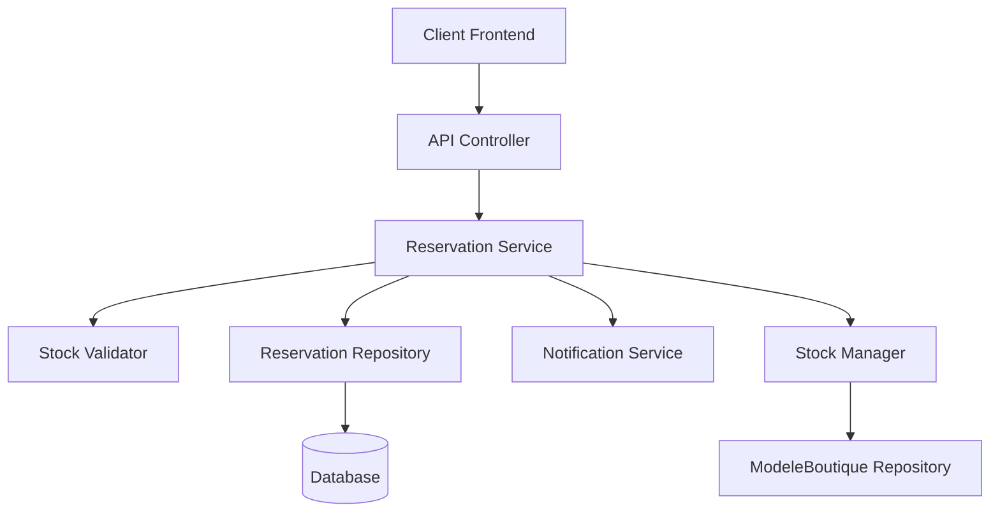
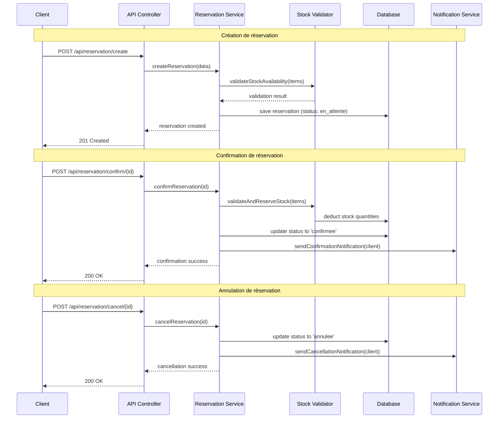
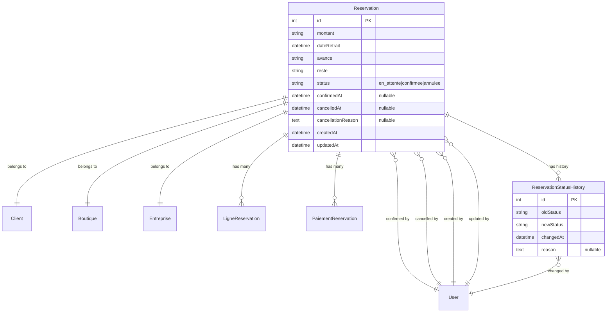

# Design Document

## Overview

Ce document présente la conception détaillée du système de gestion des réservations avec workflow de confirmation/annulation. Le système introduit un mécanisme d'état pour les réservations, permettant de différer la déduction du stock jusqu'à la confirmation effective de la réservation. Cette approche améliore la gestion des stocks en évitant les blocages inutiles et offre plus de flexibilité dans le processus de réservation.

L'architecture s'appuie sur le framework Symfony existant et utilise Doctrine ORM pour la persistance des données. Le système maintient la compatibilité avec l'API existante tout en ajoutant de nouveaux endpoints pour la gestion du workflow.

## Architecture

### Vue d'ensemble du système



### Flux de données principal



## Components and Interfaces

### 1. Entité Reservation (Modifiée)

```php
class Reservation
{
    // Champs existants...
    private ?int $id = null;
    private ?string $montant = null;
    private ?\DateTime $dateRetrait = null;
    private ?string $avance = null;
    private ?string $reste = null;
    private ?Client $client = null;
    private ?Boutique $boutique = null;
    private ?Entreprise $entreprise = null;
    
    // Nouveaux champs pour le workflow
    #[ORM\Column(length: 20, options: ['default' => 'en_attente'])]
    private string $status = 'en_attente';
    
    #[ORM\Column(nullable: true)]
    private ?\DateTime $confirmedAt = null;
    
    #[ORM\ManyToOne]
    private ?User $confirmedBy = null;
    
    #[ORM\Column(nullable: true)]
    private ?\DateTime $cancelledAt = null;
    
    #[ORM\ManyToOne]
    private ?User $cancelledBy = null;
    
    #[ORM\Column(type: 'text', nullable: true)]
    private ?string $cancellationReason = null;
}
```

### 2. Service de gestion des réservations

```php
interface ReservationWorkflowServiceInterface
{
    public function createReservation(array $data, User $user): Reservation;
    public function confirmReservation(int $reservationId, User $user): Reservation;
    public function cancelReservation(int $reservationId, User $user, ?string $reason = null): Reservation;
    public function validateStockAvailability(array $items): ValidationResult;
}

class ReservationWorkflowService implements ReservationWorkflowServiceInterface
{
    public function __construct(
        private EntityManagerInterface $entityManager,
        private StockValidatorInterface $stockValidator,
        private NotificationServiceInterface $notificationService,
        private ReservationRepository $reservationRepository
    ) {}
}
```

### 3. Validateur de stock

```php
interface StockValidatorInterface
{
    public function validateAvailability(array $items): ValidationResult;
    public function reserveStock(array $items): void;
    public function releaseStock(array $items): void;
}

class StockValidator implements StockValidatorInterface
{
    public function validateAvailability(array $items): ValidationResult
    {
        // Vérifie la disponibilité sans modifier le stock
    }
    
    public function reserveStock(array $items): void
    {
        // Déduit les quantités du stock (transaction atomique)
    }
}
```

### 4. Contrôleur API étendu

```php
class ApiReservationController extends ApiInterface
{
    // Méthodes existantes...
    
    #[Route('/confirm/{id}', methods: ['POST'])]
    public function confirmReservation(int $id): JsonResponse;
    
    #[Route('/cancel/{id}', methods: ['POST'])]
    public function cancelReservation(Request $request, int $id): JsonResponse;
    
    #[Route('/status/{status}', methods: ['GET'])]
    public function getReservationsByStatus(string $status): JsonResponse;
}
```

### 5. Énumération des statuts

```php
enum ReservationStatus: string
{
    case EN_ATTENTE = 'en_attente';
    case CONFIRMEE = 'confirmee';
    case ANNULEE = 'annulee';
    
    public function isConfirmable(): bool
    {
        return $this === self::EN_ATTENTE;
    }
    
    public function isCancellable(): bool
    {
        return $this === self::EN_ATTENTE;
    }
}
```

## Data Models

### Modèle de données étendu



### Structure de validation des données

```php
class ReservationConfirmationRequest
{
    public function __construct(
        public readonly int $reservationId,
        public readonly ?string $notes = null
    ) {}
}

class ReservationCancellationRequest
{
    public function __construct(
        public readonly int $reservationId,
        public readonly ?string $reason = null
    ) {}
}

class ValidationResult
{
    public function __construct(
        public readonly bool $isValid,
        public readonly array $errors = [],
        public readonly array $warnings = []
    ) {}
}
```

## Correctness Properties

*Une propriété est une caractéristique ou un comportement qui doit être vrai pour toutes les exécutions valides d'un système - essentiellement, une déclaration formelle sur ce que le système devrait faire. Les propriétés servent de pont entre les spécifications lisibles par l'homme et les garanties de correction vérifiables par machine.*

### Property 1: Reservation Status Initialization
*For any* new reservation created in the system, the initial status should always be set to "en_attente" regardless of the input data provided.
**Validates: Requirements 1.2, 2.5**

### Property 2: Status Field Validation
*For any* reservation stored in the system, the status field should contain only valid values from the set {"en_attente", "confirmee", "annulee"}.
**Validates: Requirements 1.1**

### Property 3: Stock Preservation During Creation
*For any* reservation creation operation, the stock quantities (ModeleBoutique quantity and global model quantity) should remain unchanged after the operation completes.
**Validates: Requirements 2.1, 2.2, 2.3**

### Property 4: Stock Availability Validation
*For any* reservation creation request, if the requested quantities exceed available stock, the system should reject the request without creating the reservation.
**Validates: Requirements 2.4**

### Property 5: Payment Independence from Stock
*For any* reservation creation with acompte payment, the payment should be recorded successfully regardless of stock levels, as long as stock validation passes.
**Validates: Requirements 2.6**

### Property 6: Confirmation Stock Deduction
*For any* reservation confirmation with sufficient stock, the system should deduct the exact reserved quantities from both ModeleBoutique and global model stock.
**Validates: Requirements 3.2, 3.3**

### Property 7: Confirmation Status Transition
*For any* reservation in "en_attente" status with sufficient stock, confirmation should update the status to "confirmee" and record confirmation metadata.
**Validates: Requirements 3.4, 3.8**

### Property 8: Confirmation Failure Atomicity
*For any* reservation confirmation that fails due to insufficient stock, no stock quantities should be modified and the reservation status should remain unchanged.
**Validates: Requirements 3.6, 3.7, 9.2**

### Property 9: Status-Based Operation Validation
*For any* reservation operation (confirm/cancel), the system should only allow the operation if the current status permits it (confirm only for "en_attente", cancel only for "en_attente").
**Validates: Requirements 3.9, 4.4, 4.5**

### Property 10: Cancellation Stock Preservation
*For any* reservation cancellation, no stock quantities should be modified since stock was never deducted during creation.
**Validates: Requirements 4.2**

### Property 11: Audit Trail Completeness
*For any* reservation status change (creation, confirmation, cancellation), the system should create complete audit records with timestamp, user, and operation details.
**Validates: Requirements 1.5, 3.8, 4.3, 10.3, 10.4**

### Property 12: API Response Consistency
*For any* reservation API response, the response should include the status field and conform to the expected JSON structure.
**Validates: Requirements 1.4**

### Property 13: Authentication Enforcement
*For any* protected reservation endpoint access without valid authentication, the system should return a 401 error.
**Validates: Requirements 5.4, 6.4**

### Property 14: Invalid ID Error Handling
*For any* reservation operation with a non-existent reservation ID, the system should return a 404 error with appropriate message.
**Validates: Requirements 5.3, 6.3**

### Property 15: Status Filtering Accuracy
*For any* reservation list request with status filter, the returned results should contain only reservations matching the specified status(es).
**Validates: Requirements 7.1, 7.2, 7.4**

### Property 16: Default Filtering Behavior
*For any* reservation list request without status filter, the system should return all reservations regardless of status.
**Validates: Requirements 7.3**

### Property 17: Filter Validation
*For any* reservation list request with invalid status values, the system should return a 400 error with descriptive message.
**Validates: Requirements 7.5**

### Property 18: Migration Data Consistency
*For any* existing reservation during migration, the system should set status to "confirmee" and add appropriate default metadata.
**Validates: Requirements 8.2, 8.3**

### Property 19: Migration Idempotency
*For any* migration execution, running the migration multiple times should produce the same result without errors or data corruption.
**Validates: Requirements 8.4**

### Property 20: Transaction Atomicity
*For any* reservation confirmation operation, either all changes (stock deduction, status update, audit trail) succeed together, or all changes are rolled back.
**Validates: Requirements 9.1, 9.5**

### Property 21: Concurrency Control
*For any* concurrent confirmation attempts on the same reservation, only one should succeed while others should fail gracefully.
**Validates: Requirements 9.3**

### Property 22: Aggregate Stock Validation
*For any* reservation confirmation, the total reserved quantities should not exceed the available stock across all items.
**Validates: Requirements 9.4**

### Property 23: Notification Delivery
*For any* reservation status change (confirmation or cancellation), appropriate notifications should be sent to the client with relevant details.
**Validates: Requirements 3.10, 4.6, 10.1, 10.2, 10.5**

## Error Handling

### Stratégie de gestion d'erreurs

Le système implémente une approche de gestion d'erreurs en couches avec des codes d'erreur spécifiques et des messages descriptifs.

#### Types d'erreurs

1. **Erreurs de validation (400 Bad Request)**
   - Données d'entrée invalides
   - Statut de réservation incorrect pour l'opération
   - Stock insuffisant lors de la confirmation
   - Valeurs de filtre invalides

2. **Erreurs d'authentification (401 Unauthorized)**
   - Token JWT manquant ou invalide
   - Session expirée

3. **Erreurs d'autorisation (403 Forbidden)**
   - Abonnement requis mais absent
   - Permissions insuffisantes pour l'opération

4. **Erreurs de ressource (404 Not Found)**
   - Réservation inexistante
   - Client ou boutique non trouvé

5. **Erreurs de conflit (409 Conflict)**
   - Tentative de confirmation concurrente
   - Modification simultanée de la réservation

6. **Erreurs système (500 Internal Server Error)**
   - Erreurs de base de données
   - Échec de transaction
   - Erreurs de service externe (notifications)

#### Format de réponse d'erreur

```json
{
    "status": "ERROR",
    "message": "Description de l'erreur",
    "code": "RESERVATION_INSUFFICIENT_STOCK",
    "details": {
        "reservationId": 123,
        "insufficientItems": [
            {
                "modeleId": 45,
                "modeleName": "Robe Africaine",
                "requested": 3,
                "available": 1
            }
        ]
    },
    "timestamp": "2025-01-30T15:30:00Z"
}
```

#### Gestion des transactions

- Utilisation de transactions Doctrine pour garantir l'atomicité
- Rollback automatique en cas d'erreur
- Logging des erreurs pour le debugging
- Retry logic pour les erreurs temporaires

#### Validation en cascade

```php
class ReservationValidator
{
    public function validateConfirmation(Reservation $reservation): ValidationResult
    {
        $errors = [];
        
        // Validation du statut
        if (!$reservation->getStatus()->isConfirmable()) {
            $errors[] = new ValidationError(
                'INVALID_STATUS',
                "Cannot confirm reservation with status: {$reservation->getStatus()->value}"
            );
        }
        
        // Validation du stock
        $stockValidation = $this->stockValidator->validateAvailability(
            $reservation->getLigneReservations()
        );
        
        if (!$stockValidation->isValid()) {
            $errors = array_merge($errors, $stockValidation->getErrors());
        }
        
        return new ValidationResult(empty($errors), $errors);
    }
}
```

## Testing Strategy

### Approche de test dual

Le système utilise une approche de test combinant tests unitaires et tests basés sur les propriétés pour une couverture complète.

#### Tests unitaires
- **Exemples spécifiques** : Validation des cas d'usage typiques
- **Cas limites** : Gestion des valeurs nulles, chaînes vides, quantités zéro
- **Conditions d'erreur** : Validation des messages d'erreur et codes de retour
- **Intégration** : Tests des interactions entre composants

#### Tests basés sur les propriétés
- **Propriétés universelles** : Validation des règles métier sur tous les inputs
- **Couverture exhaustive** : Génération automatique de cas de test
- **Configuration** : Minimum 100 itérations par test de propriété
- **Randomisation** : Utilisation de générateurs intelligents pour les données de test

### Configuration des tests de propriété

#### Framework de test
- **PHPUnit** pour les tests unitaires
- **Eris** (PHP QuickCheck) pour les tests basés sur les propriétés
- **Doctrine Test Bundle** pour les tests de base de données

#### Générateurs de données

```php
class ReservationGenerators
{
    public static function validReservationData(): Generator
    {
        return Generator\map(
            function ($montant, $avance, $clientId, $boutiqueId, $items) {
                return [
                    'montant' => $montant,
                    'avance' => $avance,
                    'reste' => $montant - $avance,
                    'client' => $clientId,
                    'boutique' => $boutiqueId,
                    'ligne' => $items,
                    'dateRetrait' => (new \DateTime('+1 week'))->format('Y-m-d H:i:s')
                ];
            },
            Generator\choose(1000, 100000), // montant
            Generator\choose(100, 50000),   // avance
            Generator\choose(1, 100),       // clientId
            Generator\choose(1, 10),        // boutiqueId
            Generator\vector(1, 5, self::validLineItem()) // items
        );
    }
    
    public static function validLineItem(): Generator
    {
        return Generator\map(
            function ($modeleId, $quantite) {
                return [
                    'modele' => $modeleId,
                    'quantite' => $quantite,
                    'avanceModele' => $modeleId
                ];
            },
            Generator\choose(1, 1000),  // modeleId
            Generator\choose(1, 10)     // quantite
        );
    }
}
```

#### Tags de test

Chaque test de propriété doit être tagué avec une référence à la propriété du document de design :

```php
/**
 * @test
 * @tag Feature: reservation-workflow-management, Property 1: Reservation Status Initialization
 */
public function testReservationStatusInitialization()
{
    $this->forAll(ReservationGenerators::validReservationData())
        ->then(function ($data) {
            $reservation = $this->reservationService->createReservation($data, $this->user);
            $this->assertEquals('en_attente', $reservation->getStatus());
        });
}

/**
 * @test
 * @tag Feature: reservation-workflow-management, Property 3: Stock Preservation During Creation
 */
public function testStockPreservationDuringCreation()
{
    $this->forAll(ReservationGenerators::validReservationData())
        ->then(function ($data) {
            // Capture initial stock levels
            $initialStocks = $this->captureStockLevels($data['ligne']);
            
            // Create reservation
            $this->reservationService->createReservation($data, $this->user);
            
            // Verify stock levels unchanged
            $finalStocks = $this->captureStockLevels($data['ligne']);
            $this->assertEquals($initialStocks, $finalStocks);
        });
}
```

#### Tests d'intégration

```php
class ReservationWorkflowIntegrationTest extends WebTestCase
{
    public function testCompleteReservationWorkflow()
    {
        // Create reservation
        $response = $this->client->request('POST', '/api/reservation/create', [
            'json' => $this->getValidReservationData()
        ]);
        
        $this->assertResponseStatusCodeSame(201);
        $reservation = json_decode($response->getContent(), true);
        $this->assertEquals('en_attente', $reservation['status']);
        
        // Confirm reservation
        $response = $this->client->request('POST', "/api/reservation/confirm/{$reservation['id']}");
        
        $this->assertResponseStatusCodeSame(200);
        $confirmedReservation = json_decode($response->getContent(), true);
        $this->assertEquals('confirmee', $confirmedReservation['status']);
        
        // Verify stock deduction
        $this->assertStockDeducted($reservation['ligneReservations']);
    }
}
```

#### Métriques de test

- **Couverture de code** : Minimum 90% pour les composants critiques
- **Couverture des propriétés** : Toutes les propriétés doivent avoir des tests correspondants
- **Performance** : Tests de charge pour les opérations concurrentes
- **Régression** : Suite de tests automatisée pour chaque déploiement

### Stratégie de test en environnement

1. **Tests unitaires** : Exécutés à chaque commit
2. **Tests d'intégration** : Exécutés sur les branches de feature
3. **Tests de propriété** : Exécutés dans la pipeline CI/CD
4. **Tests de performance** : Exécutés avant les releases
5. **Tests de régression** : Exécutés en production avec des données anonymisées